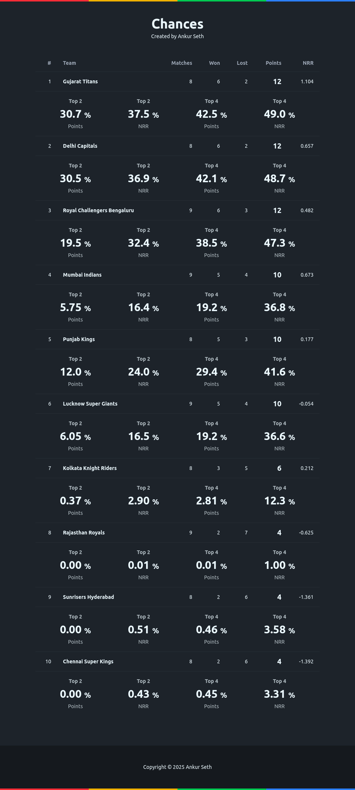

# ipl-2025-app

Everything you need to build a Svelte project, powered by [`sv`](https://github.com/sveltejs/cli).



## Creating a project

If you're seeing this, you've probably already done this step. Congrats!

```bash
# create a new project in the current directory
npx sv create

# create a new project in my-app
npx sv create my-app
```

## Developing

Once you've created a project and installed dependencies with `npm install` (or `pnpm install` or `yarn`), start a development server:

```bash
npm run dev

# or start the server and open the app in a new browser tab
npm run dev -- --open
```

## Building

To create a production version of your app:

```bash
npm run build
```

You can preview the production build with `npm run preview`.

## Run Simulations

To run 10k simulations for playoff probabilities:

```bash
python3 sim.py sim -n 10000
```

## Screenshot

To take a screenshot of your app:

```bash
python3 shoot.py
```

This will take the screenshot and save it as `screenshot.png`.


